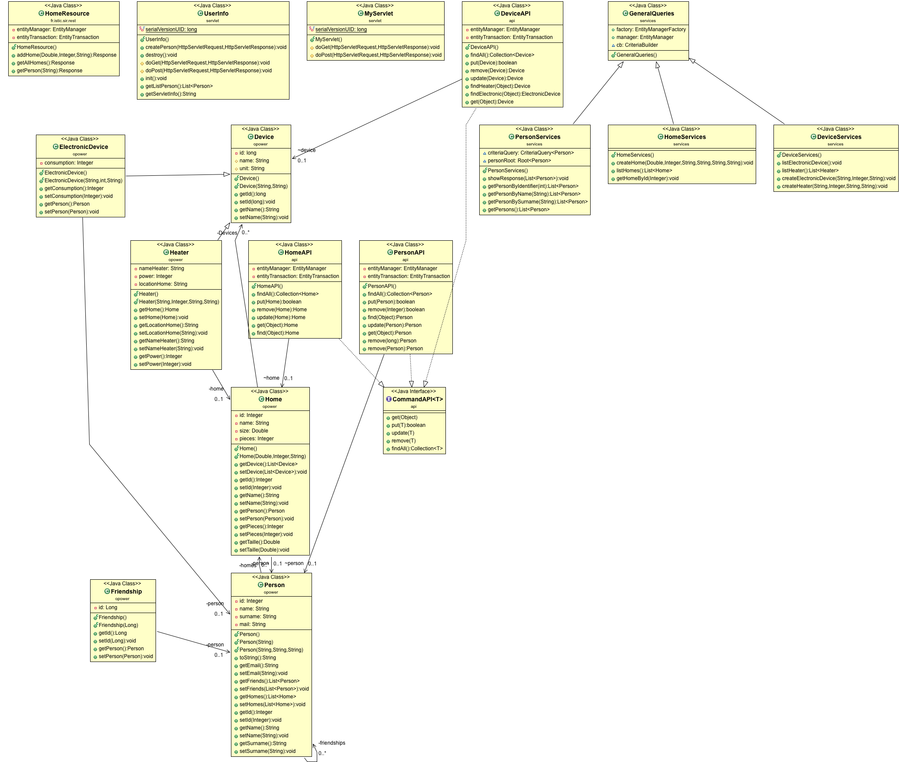

# Design (TP4)
## Packages

### src/main/java/api/opower
Ce paquet contient les entités du modèle opower.
- Device: est la classe parent de ElectronicDeviceHeater
  - ElectronicDevice: un dispositif électronique qui se situe sur la maison.
  - Heater: un chauffage qui va être à la maison.
- Home: la maison où on trouve un ou plusieurs chauffages et dispositif électroniques.
- Person: une personne que peut avoir une ou plusieurs maisons et aussi une au plusieurs relations d'amitié avec d'autres personnes.

### fr.istic.sir.rest
Ce dossier contient l'implementation du serveur web, les functionalités de ce module son disponibles sur http://localhost:8080/rest. Cette paquet contient les services pour faire des requetes sur les devices, persons et Homes.
Tous les response sont retourne en JSON, les methods POST utilise le content-type "application/x-www-form-urlencoded"

### src/main/java/api
Dans ce pacquage on trouve l'entityManager de l'application et les classes d'accès au data DAO, utilisées pour faire de requêtes d'insertion, sélection, modification et suppression à la base de données.
- LocalEntityManager (entityManager)
- HomeAPI
- DeviceAPI
- PersonAPI

Aussi, dans ce pacquage il y a une interface qui est utilisée par les classes DAO qui define les operation basiques (put, remove, add)

- CommandAPI

### services
Requetes qui utilisent le criteria query pour recuperer l'information

### fr.istic.sir.tp4.web

Ce pacquage contient deux dossier pour les servlets (Home et Person) qui sont utilisés pour receptioner les requétes POST et GET faites a travers http://localhost:8080/home et http://localhost:8080/person

### Servlets (HTML)
#### Dossier persons
- index.html: Interface pour enregistre une persone
- listperson.html: Interface pour montrer une liste de tous les personnes dans le systeme.
- person_post.jsp: Interface pour montrer l'information d'une personne qui vient d'etre enregistre
- persons.jsp: 

#### Dossier home
- index.html: 
- listhome.html: 
- home_post.jsp: 
- homes.jsp: 

### Diagramme de classes

